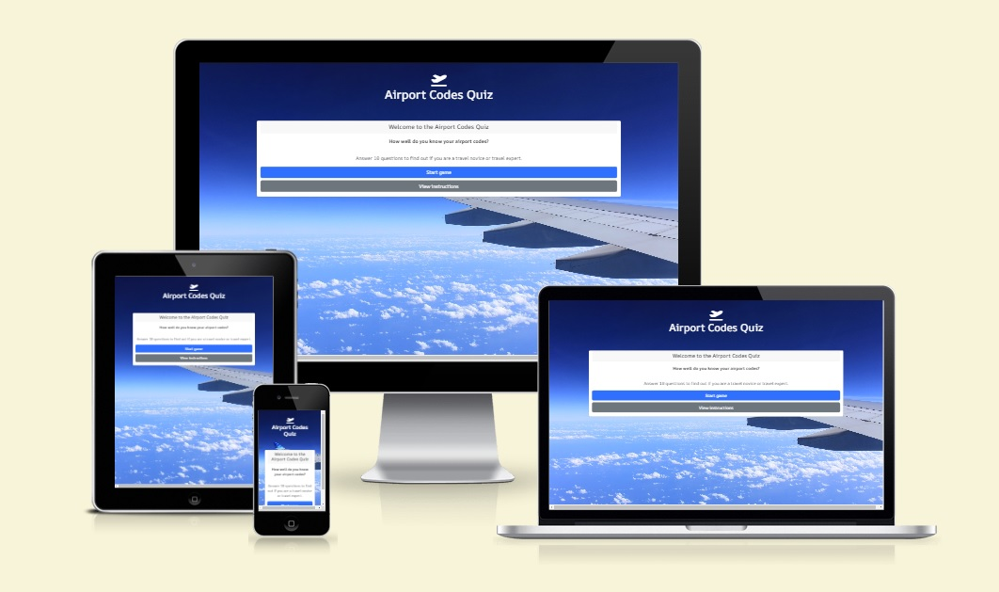
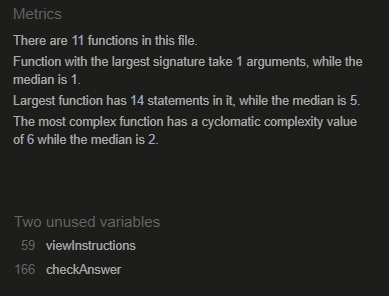

# Milestone Project 2: Airport Codes Quiz

## Live Project

[View the live project](https://cshimvin.github.io/quiz-ms-2/)

## Table of Contents
1. [Project Goals](#project-goals)
- Business Goals
- User Goals
2. [User Experience](#user-experience)
- User Stories
- Design and Structure
- Wireframes
3. [Features](#features)
- Must Have (current features)
- Could Have
- Won't Have (for now)
4. [Technologies Used](#technologies-used)
5. [Testing](#testing)
- User stories tests
- Functionality
- HTML Validation
- CSS Validation
- JS Validation
- Accessibility and Performance
- Browser Compatibility
- Device Compatibility
6. [Bugs](#bugs)
7. [Deployment](#deployment)
8. [Credits](#credits)

## Project Goals

### Developer Goals

As a developer, I would like the website to be fun and interactive and enable visitors to learn about airport codes of the world. This would be particularly useful for those visitors who are planning to join the aviaton industry.

### Visitor Goals

As a visitor, I would like the website to:
- be easy to understand
- be easy to navigate
- be able to use the quiz on a variety of devices
- enable me to learn about airport codes and test my knowledge on them

## User Experience

### User Stories
- First time visitor goals:
  - As a first time visitor, I would like to be able to find out what the site is about.
  - As a first time visitor, I would like to know what the quiz is about and how to play it.
  - As a first time visitor, I would like to take part in the quiz and get my results to see how well I did.

- Returning visitor goals:
  - As a returning visitor, I would like to try the quiz again to see if I can get a better score.
  - As a returning visitor, I would like to be able to remember the airport codes that were presented.

- Frequent visitor goals:
  - As a frequent visitor, I would like to keep testing my knowledge on airport codes and get a better score each time.

### Design and Structure

### Wireframes

Wireframes of the initial design can be found in the PDF.

## Features

### Current features

These are the features that have already been implemented on the website.

### Features the site could have

### Features the site won't have (for now)

## Technologies Used

- [HTML5](https://en.wikipedia.org/wiki/HTML5) to create the website.
- [CSS3](https://en.wikipedia.org/wiki/CSS3) to style the website.
- [Bootstrap 5](https://getbootstrap.com/) was used for the layout of the site.
- [FontAwesome](https://fontawesome.com/) was used to create some of the icons on the site.
- [Google Fonts](https://fonts.google.com/) was used to display the typography of the site: [Montserrat](https://fonts.google.com/specimen/Montserrat) and [REM](https://fonts.google.com/specimen/REM).
- [Git](https://git-scm.com/) was used for version control of the code.
- [GitHub](https://github.com/) was used as a repository for the code and GitHub pages was used to host the site.
- [Javascript](https://developer.mozilla.org/en-US/docs/Web/JavaScript) to create the functionality of the site
- [JQuery 3.7.1](https://jquery.com/) was used for selecting and manipulating elements in the DOM

## Testing

###  User stories tests

| User story                                                            | Outcome                                                                        | Result |
| --------------------------------------------------------------------- | ------------------------------------------------------------------------------ | ------ |
| As a visitor, I would like to easily find out about the site is about | As a visitor, I can understand that this is a quiz website about airport codes | PASS   |
| As a visitor, I want to be able to know how to play the quiz          | As a visitor, I can see there are instructions on how to play the quiz         | PASS   |
| As a visitor, I want to be able to play the quiz                      | As a visitor, I can click on the start quiz button to start the quiz           | PASS   |
| As a visitor, I want to be able to see my quiz results                | As a visitor, I can see my retuls during the game and at the end of the quiz   | PASS   |

### Functionality

| Feature                  | Expected outcome                                                                                                 | Action                                        | Result |
| ------------------------ | ---------------------------------------------------------------------------------------------------------------- | --------------------------------------------- | ------ |
| Start quiz button        | When clicked it starts the quiz                                                                                  | Clicked the start quiz button                 | PASS   |
| View instructions button | When clicked it shows the instructions                                                                           | Clicked the view instructions button          | PASS   |
| Wrong answer button      | When clicked it shows the correct answer                                                                         | Clicked the button of the wrong answer        | PASS   |
| Correct answer button    | When clicked it shows the answer clicked is correct                                                              | Clicked the button of the correct answer      | PASS   |
| Answer button            | When clicked it shows the reponse and disables the answer buttons and enables the next question button           | Clicked an answer button                      | PASS   |
| Next question button     | When clicked it shows the next question and answers and disables the next question button                        | Clicked the next question button              | PASS   |
| View results             | On the last question, when clicked it shows your results                                                         | Clicked the view results button               | PASS   |
| Page not found page      | When the incorrect web page address is entered, is produces a 404 page which guides users back to the index page | Visited a page that doesn't exist in the site | PASS   |

## JavaScript tests

When developing the site I regularly console logged results to ensure that the expected results were displayed. 

### HTML Validation

The [index.html](index.html) and [404](404.html) pages were tested using the [W3C HTML validator](https://validator.w3.org/nu/) and no errors were found. The results are in the [Quiz page HTML validation results PDF](assets/documents/html-validation.pdf) and [404 page HTML validator results PDF](assets/documents/html-validation-404.pdf).

### CSS Validation

The CSS stylesheet [style.css](assets/css/style.css) was checked using the [W3C CSS validator](https://jigsaw.w3.org/css-validator/) and no errors were found. The results can be found in the [CSS validation results PDF](assets/documents/css-validation.pdf).

### JS Validation

[JSHint](https://jshint.com/) was used to validate the JavaScript for script.js using the configuration to assume ES6 and jQuery. The validator identified 3 statements without semicolons which were corrected and the script.js file then passed validation.

### Accessibility and Performance

Accessibility was checked to ensure that Aria labels and image alt text was added to all images and visual elements on the site.

Lighthouse reports were also created on desktop and mobile which passed accessibility except sequential headings as h5 was used in the card sectionas recommended by Bootstrap. Changing this to h2 would change the look of the quiz but this could be looked at in future iterations. There were also a few performance suggestions which could be implemented in future iterations:
- [Lighthouse report on index.html desktop page](assets/documents/lighthouse-report-quiz-desktop.pdf)
- [Lighthouse report on index.html mobile page](assets/documents/lighthouse-report-quiz-mobile.pdf)
- [Lighthouse report on 404.html desktop page](assets/documents/lighthouse-report-404-desktop.pdf)
- [Lighthouse report on 404.html mobile page](assets/documents/lighthouse-report-404-mobile.pdf)

### Browser Compatibility

The website has been tested on the following browsers:
- Google Chrome Version 116.0.5845.141 (Official Build) (64-bit)
- Microsoft Edge Version 118.0.2088.46 (Official build) (64-bit)
- Mozilla Firefox Version 115.0.3 (64-bit)

The layout, functionality and website works on all the above browsers.

### Device Compatibility

The responsiveness and layout of the site has been tested on a number of devices including tablets, desktops and mobile phones from iPhone 5 to 5K screens and the website displays correctly.

Chrome developer tools were used at various points during the development including when changes were made to the layout.

### Check links work

Button links were JavaScript based so the console was used in Chrome Developer tools to ensure they worked correctly and went to the correct part of the quiz.

## Bugs

Bugs fixed:
- Issue with incrementing questions and checkAnswer function in script.js - the _questionNum++_ statement was in the incorrect function which caused the quiz to increment the question number by a random number. This was moved to the checkAnswer function to correct this issue.
- The CSS was not loading due to a typo in the href of the CSS link statment in index.html. This was fixed so it worked.

## Deployment

### How the site was deployed

The site was deployed using GitHub and is hosted on GitHub Pages and was deployed as follows:

- Navigate to the [GitHub repository](https://github.com/cshimvin/quiz-ms-2)
- Go to the **Settings** section
- Click on **Pages** on the left hand side menu
- Under **Branch**, select the **Master** branch then click Save
- After a few minutes a link to the deployed site will appear at the top of the page
- Any changes pushed to the main branch will take effect on the deployed site

### How to clone this repository

- Go to the repository at https://github.com/cshimvin/quiz-ms-2 on GitHub
- Click on the **Code** button and copy the https URL under **Clone**
- Open a terminal on GitBash
- Navigate to the folder you want to store the cloned repository
- In the terminal type `git clone` and paste the URL of the cloned repository after it then press Enter
- The site will then be cloned to that directory

## Credits

### Images

Any images not referenced are owned by the developer. Background image was obtained from pxhere.com and is Free for personal and commercial use. No attribution required.

Background image - https://pxhere.com/en/photo/1245082

### Code

Shuffle answer order - Array randomiser function in script.js is taken from W3docs https://www.w3docs.com/snippets/javascript/how-to-randomize-shuffle-a-javascript-array.html
